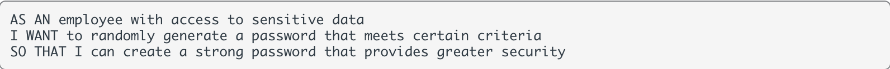
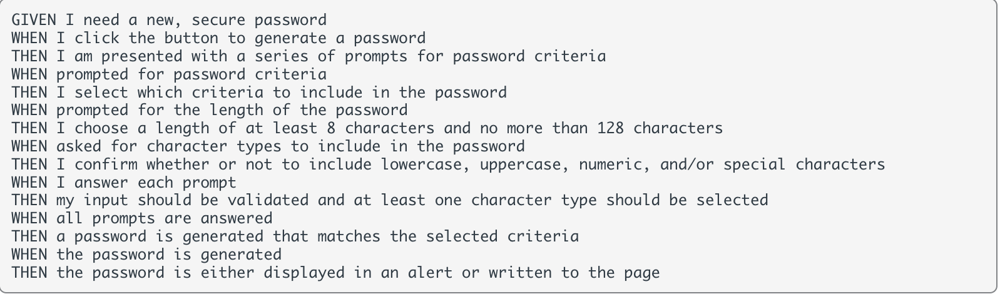

# JavaScript Password Generator

## Description
<!--
Provide a short description explaining the what, why, and how of your project. Use the following questions as a guide:

- What was your motivation?
- Why did you build this project? (Note: the answer is not "Because it was a homework assignment.")
- What problem does it solve?
- What did you learn? -->

### User Story

### Acceptance Criteria

<!--
## Usage

Provide instructions and examples for use. Include screenshots as needed.

 -->

## License

Please refer to the LICENSE in the repo.

<!--
## Links

Deployed Application: 

Repository:  -->
